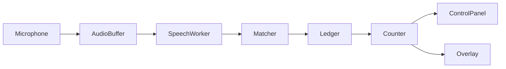

# Architecture

One native desktop application, written in Python 3.12 with PySide6 widgets.
The default model is large-v3 on CUDA in FP16, with language fixed to Hungarian
and transcription enabled. Turbo/GPU and Small/CPU are selectable alternatives.

## Data flow

- `audio.py`: a thread-safe, bounded 30-second history addressed by absolute
  sample positions. The microphone callback copies audio and updates the level
  meter; recognition never runs inside the callback.
- `engine.py`: a Qt background thread loads and warms the model, opens the selected
  input, resamples to 16 kHz when necessary, and transcribes six-second windows
  every two seconds. The first window becomes available after three seconds.
  Silero VAD filters non-speech. A short trailing guard defers incomplete words
  to the next overlapping window. Inference time adds to this buffering delay.
- `matching.py`: accepts acronym variants and Hungarian word forms, maps them
  back to word timestamps, filters low-confidence matches, and deduplicates
  repeated observations one-to-one. Separate mentions in one result remain
  separate even when spoken rapidly.
- `ui.py`: owns the count and ledger on the GUI thread. Queued worker signals
  update both windows. The recent transcript and detection history stay in memory.
- `overlay.py`: a frameless topmost Qt window. Locked mode passes mouse events
  through and does not accept keyboard focus. Unlocked mode permits dragging.
  The UI anchors it to any display corner with a 24-pixel logical margin, or
  retains a custom dragged position. Right and bottom anchors are recalculated
  when the counter width or font size changes.
- `native.py`: Windows global hotkeys, unregistered on shutdown. Conflicts are
  reported to the control panel.
- `runtime.py`: discovers NVIDIA wheel DLL directories and exposes them only to
  the application process. System CUDA and global PATH are not modified. It also
  initializes and balances Windows COM on the audio worker thread before opening
  WASAPI. PortAudio documents this requirement in its
  [WASAPI implementation](https://github.com/PortAudio/portaudio/blob/master/src/hostapi/wasapi/pa_win_wasapi.c).
- `settings.py`: validates and atomically stores settings in local application
  data. A corrupt settings file falls back to defaults.
- `storage.py`: the Storage & cleanup dialog, with models selected by default
  and optional settings removal. Its confirmation explains that cleanup exits
  the app and that removed models need to download again.
- `cleanup.py`: removes only selected models and settings under the app's data
  directory. It validates the resolved target and rejects linked root/model
  directories. Nested junctions are removed without deleting their targets.

## Session boundaries

Pausing stops the microphone stream and invalidates buffered results. Resuming
clears previous audio and starts a new observation generation while keeping the
count. Reset invalidates any inference already in flight, clears the ledger and
history, and sets the count to zero. Manual corrections change the count without
forgetting already observed speech. Ending a session releases the worker/model;
pause/resume retains the loaded model for quick continuation.

Shutdown requests the worker to stop and waits without blocking the GUI event
loop. It never forcibly terminates a thread using the GPU. A model download or
inference already in progress finishes before shutdown completes. A local lock
prevents accidentally launching two copies against the same GPU and settings.

Cleanup first stops the speech worker, including any in-progress download or
inference, then removes files on a separate thread while the UI stays responsive.
On success the app exits. Settings removal disables saving on shutdown so the
file is not recreated. After the event loop ends, the instance lock is released
and the data directory is removed only if empty. Failures are shown in the UI
and leave the app open for retry; some files may already have been removed.
The portable executable folder is never deleted by this control.
Downloader Hub and Xet caches for new sessions also live under `models/.cache`,
so models cleanup includes them. Cache locations are set only in the app process;
cleanup does not touch shared Hugging Face caches used by other applications.

When the Windows tray is available, closing the control panel hides it while
recognition and the overlay continue. The V tray icon restores the panel and
offers listening controls, overlay visibility, and an explicit Exit action.
Exit starts the existing graceful worker shutdown. If no tray is available,
closing the panel exits normally. Qt's
[QSystemTrayIcon](https://doc.qt.io/qtforpython-6/PySide6/QtWidgets/QSystemTrayIcon.html)
handles native activation and the context menu.

## Reliability boundaries

This is buffered speech transcription, not a phonetic keyword detector with a
guaranteed trigger delay. Word timing may shift between overlapping windows.
Deduplication uses interval overlap and a small timing tolerance; especially fast
repetitions that the recognizer itself merges can still be missed. Confidence
scores are heuristics. Microphone overflow and recognition backlog are reported,
not silently hidden. If decode time regularly exceeds the two-second hop, use
Turbo or improve available GPU capacity.

The file benchmark uses the live window geometry and flushes its final partial
window. It is useful for comparing model/threshold settings. Live microphone,
accent, projector, and PowerPoint checks remain part of rehearsal.

## Packaging

The PyInstaller specification produces a folder distribution including the
GPU libraries. Models are kept separately under the user's local application
data. Pin dependencies with `uv.lock`; setup and build scripts do not need
credentials or write to external repositories.

Version-tag automation and local release packaging are described in
[releases.md](releases.md). The packaged smoke check renders both windows and
imports the recognition stack without a microphone or model download, allowing
the release build to run on a hosted Windows runner without an NVIDIA GPU.
